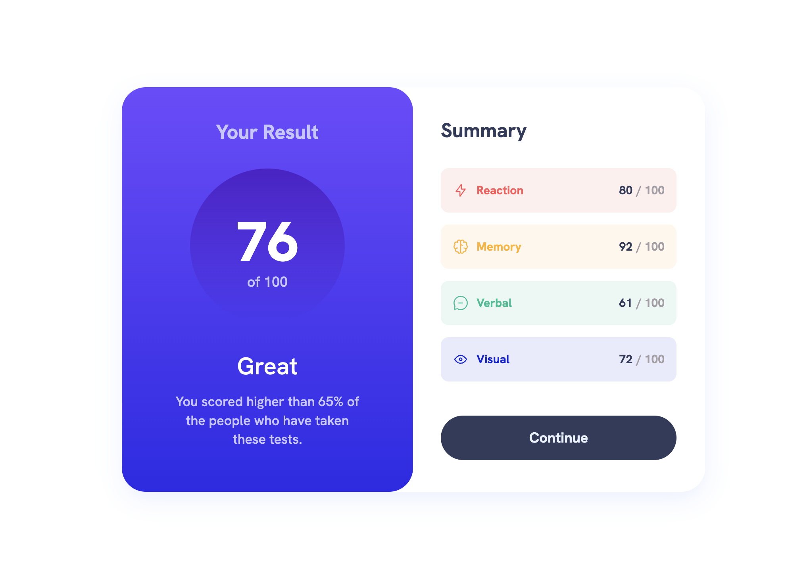

# Frontend Mentor - Results summary component solution

This is a solution to the [Results summary component challenge on Frontend Mentor](https://www.frontendmentor.io/challenges/results-summary-component-CE_K6s0maV). Frontend Mentor challenges help you improve your coding skills by building realistic projects.

## Table of contents

- [Overview](#overview)
  - [The challenge](#the-challenge)
  - [Screenshot](#screenshot)
  - [Links](#links)
- [My process](#my-process)
  - [Built with](#built-with)
  - [What I learned](#what-i-learned)
- [Author](#author)

## Overview

### The challenge

Users should be able to:

- View the optimal layout for the interface depending on their device's screen size
- See hover and focus states for all interactive elements on the page

### Screenshot

### Links

- [See live site here](https://thomaserdmenger.github.io/resultsSummaryComponent/)
- [GitHub Repository](https://github.com/thomaserdmenger/resultsSummaryComponent)

## My process

### Built with

- Semantic HTML5 markup
- CSS custom properties
- Flexbox
- Mobile-first workflow
- JavaScript
- Fetch API and JSON

### What I learned

I have created the entire colored button container with all its elements using JavaScript and retrieved the data
from the JSON file using the Fetch API with asynchronous code. For the styling of the elements I used CSS.

I've learned how to create elements and set classes with JavaScript. Also I've learned how to fetch data from
JSON and how to implement this data in newly created elements.

## Author

- Frontend Mentor - [@thomaserdmenger](https://www.frontendmentor.io/profile/thomaserdmenger)
- GitHub - [@thomaserdmenger](https://github.com/thomaserdmenger)
